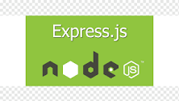

# Simple Node API



This repository contains a simple Node.js API with a few endpoints(users). The goal is to deploy this API to [Vercel](https://vercel.com/)

## Getting Started

Follow these steps to set up and deploy the API:

### 1. Clone the Repository

```bash
git https://github.com/soleil00/simple-node-api
cd simple-node-api
```

### 2. Configure your .env variable

Create a .env file in the root of your project and add the following variables:

env
Copy code
PORT=3000
MONGODB_URL=mongodb+srv://<mongodb-username>:<mongodb-password-to-specified-user>@cluster0.3jrwzmq.mongodb.net/SoleilDB?retryWrites=true&w=majority
Make sure to replace <mongodb-username> and <mongodb-password-to-specified-user> with your MongoDB credentials.

### 3. Deploy to Vercel

To deploy your API to Vercel, you'll need a vercel.json file, which is already included in the source code.

Create a new git repository and push this source code to your repo.
Create an account at Vercel.
Connect your GitHub account with Vercel.
Select your repository as the target for deployment.
For the framework, choose "Other" for a Node.js app.
Configure your environment variables, and click "Deploy."
Your API will be deployed, and Vercel will provide you with a public URL.

## Contributing

Feel free to contribute by opening issues or submitting pull requests.

# Happy coding! 🚀
